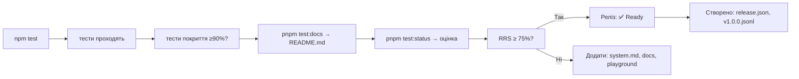

# 📜 `@nan0web/test` — система тестування для пробудження

**Мета**: зробити **довірене знання** із кожного тесту.  
Тест — не просто перевірка коду, а **доведення існування** ідеї в світі коду.

> Кожен тест — це **свідчення того, що «це» працює**, а не можливість.  
> Кожна документація — код, який уже виконаний.

---

# 🧩 **Інструкція по кожному пакету з `@nan0web/test`**  
(українською, за стандартом `nan0coding`)  
+ зв’язок із монорепою + специфіка пакета

---

## 📌 `@nan0web/test` — Ядро довіри

**Призначення**:  
Набір інструментів, які дозволяють **довести код як знання**, перевірене в трьох режимах:
- **виконання** (`test`)
- **покриття** (`coverage`)
- **документування** (`docs → dataset`)

> ✅ Довірений код — це код, який **навчає інші системи**, не лише виконується.

---

### 🔧 Базова структура

```
@nan0web/test/
├── src/
│   ├── index.js                 # головні експорти
│   ├── Parser/                  # парсери документації
│   │   ├── DocsParser.js        # парсинг jsdoc/@docs → markdown
│   │   ├── DatasetParser.js     # markdown → JSONL (LLM dataset)
│   │   └── NodeTestParser.js    # TAP → tree (TestNode)
│   ├── mock/                    # моки для ізоляції
│   │   ├── fetch.js             # мок fetch
│   │   └── MemoryDB.js          # мок баз даних
│   ├── exec/                    # виконання процесів
│   │   └── runSpawn.js          # spawn node
│   ├── commands/                # CLI команди
│   │   ├── status.js
│   │   └── coverage.js
│   ├── RRS.js                   # Release Readiness Score
│   ├── TestPackage.js           # модель аналізу проєкту
│   └── README.md.js             # генерація довіреної документації
├── bin/nan0test.js              # CLI інтерфейс
├── types/                       # TypeScript типи (тільки `.d.ts`)
├── playground/main.js           # інтерактивні демонстрації
├── .datasets/README.jsonl       # довірений dataset (zero-copy)
└── system.md                    # інструкції на рівні пакета (укр.)
```

---

## 🔹 Інтеграція з монорепою: загальні вимоги (`system.md`)

1. **Типізація через JsDoc**  
   → TypeScript лише для `types/**/*.d.ts`, `tsc` — для валідації
2. **100% покриття тестами**  
   → Вимога: `≥ 90%` (див. `pnpm test:coverage`)
3. **Перевірена документація**  
   → `src/README.md.js` — **є тестом** і генерує:
   - `README.md` (англ.)
   - `.datasets/README.jsonl` (навчальний dataset)
4. **Playground** — CLI демо, без build  
   → Доказ, що система **робоча, доступна, читабельна**
5. **Відсутність примусу**  
   → Немає реєстрації, трекінгу, зовнішніх залежностей
6. **Реліз = фізичний артефакт**  
   → `.coverage/test.json`, `.jsonl`, `git tag`, `npm publish`

---

# ✅ Специфіка під кожен пакет (функціонал + ідея + перевірка)

---

## 🔹 `RRS` — Система оцінки готовності релізу

**Файл**: `src/RRS.js`, `types/RRS.d.ts`

### 🎯 Ідея
> «Реліз» — це не версія. Це **доведене життя проєкту**.

`RRS` (Release Readiness Score) — система оцінки, **чи проєкт «живий»**.

- Якщо тест падає → не пройшов реліз
- Якщо немає `system.md` → немає розуміння
- Якщо немає `README.md.js` → немає довіри

> RRS — це **архетип пробудження проєкту**.

### ✅ Що робить?
- Оцінює наявність: `git`, `test`, `build`, `system.md`, `tsconfig.json`
- Додає бонус: `playground`, `docs`, `переклади`, `npm publish`, `LICENSE`
- Підраховує % від максимального значення (за замовчанням — 624)
- Повертає `todo`, `missing`, `icon`, `percentage`

### 🔧 Інструкція використання
```js
import { RRS } from "@nan0web/test"

const rrs = new RRS({
	required: { git: 100, testPass: 100 },
	optional: { playground: 50, testCoverage: 0 }
})

// Додай стан з тестів:
await rrs.run({ name: "testPass", value: true })
await rrs.run({ name: "git", value: true })

console.log(rrs.percentage) // → 50%
console.log(rrs.todo)       // → ['playground', 'systemMd']
```

> **документація = тест**, тому кожен приклад у `README.md.js` додає бали.

---

## 🔹 `TestPackage` — модель аналізу проєкту

**Файл**: `src/TestPackage.js`, `types/TestPackage.d.ts`

### 🎯 Ідея
> Кожен проєкт — це **об’єкт уніфікованого аналізу**, який:
> - знає свій код
> - має `DB`
> - може запускати команди
> - рендериться в статус

> Ти не перевіряєш пакет —  
> Ти **намічаєш його виявлення**.

### ✅ Що робить?
- Моделює пакет як об’єкт (`cwd`, `name`, `hash`, `db`)
- Має метод `run(rrs)` → запускає перевірки на `RRS`
- Надає `render()` → формат текст/таблиця
- `toMarkdown()` → `.md` зі статусом
- `toObject()` → можна зберегти, передати, об’єднати

### 🔧 Інструкція використання
```js
import { RRS, TestPackage } from "@nan0web/test"

const pkg = new TestPackage({ cwd: process.cwd() })
const rrs = new RRS()

for await (const result of pkg.run(rrs)) {
	console.log(result)
}

// Результат: { name: "testPass", value: true } ...
```

> Це **не інструмент**, а **виявлення існування**.

---

## 🔹 `ReactTestPackage` — уявлення реакт-проєкту

**Файл**: `src/TestPackage.js`, `types/ReactTestPackage.d.ts`

### 🎯 Ідея
> `ReactTestPackage` — це **успадкування `TestPackage`** з підставленням:
> - `DEV_DEPENDENCIES` для `vitest`, `vite`
> - встановлення `@nan0web/ui-core`, `@nan0web/types` як залежностей

> Це не «реакт» — це **довірений проєкт з клієнтським UI**.

### ✅ Наслідування
```js
class ReactTestPackage extends TestPackage {
	static DEV_DEPENDENCIES = { ...TestPackage.DEV_DEPENDENCIES, vitest: "^2" }
}
```

> Використовуй, коли ти тестуєш бібліотеку типу `@nan0web/ui-react`.

---

## 🔹 `mockFetch` — простий мок `fetch`

**Файл**: `src/mock/fetch.js`, `types/mock/fetch.d.ts`

### 🎯 Ідея
> `fetch` — не зовнішній світ. Це **утиліта, яку можна держати в межах тесту**.

`mockFetch` — це **функція, яка імітує мережу**, без залежності від `node-fetch`.

### ✅ Як використовувати?
```js
const routes = [
	["GET /api/users", { id: 1, name: "Олена" }],
	["POST /api/users", [201, { success: true }]]
]

const fetch = mockFetch(routes)

const res = await fetch("/api/users")
res.status // → 200
res.ok     // → true
await res.json() // → { id: 1, name: "Олена" }
```

> Підтримує:
> - `method url`
> - `* *` — загальний маршрут
> - `[* /route/*]` — wildcard
> - `[201, data]` — статус + тіло

> Використовуй для **безболісного тестування API-викликів**.

---

## 🔹 `MemoryDB` — мок `@nan0web/db`

**Файл**: `src/mock/MemoryDB.js`, `types/mock/MemoryDB.d.ts`

### 🎯 Ідея
> Щоб знати, як працює `DB`, — не треба чекати на диск.  
> Достатньо **пам’яті**.

`MemoryDB` — це `DB`, який існує **в оперативній пам’яті**,  
але має той самий інтерфейс, що й `@nan0web/db-fs`.

### ✅ Функціонал
```js
const db = new MemoryDB({
	predefined: new Map([
		["config.yaml", "baseURL: local"],
		["data/user.json", '{"name": "Михайло"}']
	])
})

await db.connect()
const user = await db.loadDocument("data/user.json")
```

> Має `accessLogs` → щоб бачити, що відбувалося

> Ідеальний для **unit-тестів**, де потрібен `DB`, але не потрібен файлова система.

---

## 🔹 `DocsParser` — парсер `@docs`

**Файл**: `src/Parser/DocsParser.js`, `types/Parser/DocsParser.d.ts`

### 🎯 Ідея
> Документація — це **не текст**.  
> Це **витягнутий процес свідомості**.

`DocsParser` витягує з `JSDoc` анотацію `@docs` і об'єднує її з виконуваними прикладами.

### ✅ Як працює?
```js
/**
 * @docs
 * # Як використовувати
 */
it("has to add numbers", () => {
	const res = add(1, 2)
	assert.equal(res, 3)
})
```

```js
const parser = new DocsParser()
const node = parser.decode(fnWithDocs) // ← fn з `@docs`

String(node) // → markdown, де:
// - заголовки з `@docs`
// - приклади коду з тіла `it()`
```

> Парсер бачить:
> - `/** @docs\n* ... */`
> - `assert.` → умову тесту
> - `it("label")` → створює розділ
> - `/**\n* ```bash` → змінює мову прикладу

---

## 🔹 `DatasetParser` — перетворення `md` → `JSONL`

**Файл**: `src/Parser/DatasetParser.js`, `types/Parser/DatasetParser.d.ts`

### 🎯 Ідея
> Довірена документація стає **навчальним знанням**.

`DatasetParser.parse(text, pkgName)` перетворює `README.md` у масив:
```json
[{
	"instruction": "How to install with npm?",
	"output": "```bash\nnpm install package-name\n```",
	"context": "Installation",
	"input": "",
	"tags": ["install", "npm"],
	"proven": true
}]
```

> Це **zero-copy dataset** → кожен блок **вже перевірений**.

### ✅ Де використовується?
- У CI: після запуску `test:docs` → генерує `.datasets/*.jsonl`
- В інших інструментах: `@nan0web/llimo`, `@nan0web/story`
- Як навчальний матеріал для моделей

> Кожен `dataset` — це **підтвердження існування**.

---

## 🔹 `NodeTestParser` + `TestNode` — парсер TAP виводу

**Файли**: `src/Parser/NodeTestParser.js`, `src/Parser/TestNode.js`

### 🎯 Ідея
> `node --test` видає TAP-формат.  
> Щоб його зрозуміти — треба **перетворити на дрібніші одиниці**.

`NodeTestParser` парсить `TAP` → дерево з `TestNode`.

### ✅ Функціонал
```js
const parser = new NodeTestParser()
const text = `TAP version 13\nok 1 tests pass`

const node = parser.decode(text)
console.log(node.version)     // 13
console.log(node.passCount)   // 1
console.log(node.failCount)   // 0
console.log(node.durationMs)  // 15
```

> Використовується для **вибіркового аналізу тестів**, зокрема:
> - `skip`, `todo`, `fail`
> - ієрархічні `describe`

> Відновлення інформації з виведення → **повернення до суті**.

---

## 🔹 `runSpawn` — безпечний запуск процесів

**Файл**: `src/exec/runSpawn.js`, `types/exec/runSpawn.d.ts`

### 🎯 Ідея
> Щоб бути впевненим — треба запустити команду.  
> Але не створювати хаос.

`runSpawn` ізолює виклик процесу в `child_process.spawn`.

### ✅ Як використовувати?
```js
const { code, text } = await runSpawn("git", ["remote", "get-url", "origin"])
// → code: 0
// → text: "https://github.com/nan0web/test.git"
```

> Підтримує:
> - `onData` для читання потоку
> - `cwd` — дозволяє запускати в іншому каталозі

> Довірене виконання команд — це **шлях до автономного тестування**.

---

## 🔹 CLI: `nan0test`

**Файл**: `bin/nan0test.js`, `types/commands/*.d.ts`

### 🎯 Ідея
CLI — це **мовна взаємодія з системою**, а не інтерфейс управління.

#### `nan0test coverage`
> Запускає `node --test-coverage` і зберігає результат у `.coverage/test.json`

#### `nan0test status`
> Показує статус пакета:
> - ✅ Назва, стан, покриття, функції, npm
> - Можна приховати стовпці: `--hide-status`
> - `--todo` — показати лише що треба додати
> - `--format md` → повернути `.md` для вставки

### ✅ Приклад
```bash
nan0test status --hide-name --todo --format md
```

> Виведе:
> ```md
> | docs | coverage | features | npm |
> |------|----------|----------|-----|
> | ✅   | 🚧 85%    | 🚧       | ❌  |
> ```

> Це **не статус**, а **відбиття свідомості** про стан.

---

## 🔹 `playground/main.js` — інтерактивне доведення

### 🎯 Ідея
> Пробуджений — той, хто **пробує**.

`playground/main.js` — це CLI-меню, де можна:
- запустити `mockFetch`
- створити `MemoryDB`
- перевірити `DocsParser`
- побачити `DatasetParser`
- перевірити `runSpawn`

> **Без збірки, без build**, лише `node playground/main.js`

### ✅ Важливість
- Це **доказ**, що пакет може працювати окремо
- Немає залежностей → окрім devDeps
- Кожен приклад — **дія**, а не ілюстрація

---

## 📚 Доверена документація: `README.md.js`

### 🎯 Ідея
> Документація — це **жива частина коду**, яка:
> - пишеться в `JSDoc` та `@docs`
> - стає тестом і виконується
> - перетворюється на `README.md`
> - генерує `dataset`

### 📌 Процес
1. Пишеш тест з `@docs` в `it(...)` — це **дія з наміром**
2. Запускаєш `pnpm test:docs` → `node --test src/README.md.js`
3. Виконується:
   - `DocsParser.decode(fn)`
   - `String(node)` → markdown
   - зберігається в `README.md`
4. `DatasetParser.parse(text)` → генерує `.datasets/README.jsonl`

> ✅ Довірена документація = **кожне "як використовувати" працює**

---

## 🔁 Процес релізу



> Якщо немає `RRS` — немає довіри.

---

## 🔄 АрхіТехноМаг рекомендує:

- Питай: **"чи цей тест створює НаМір?"**
- Напиши один тест — виконай його як дію
- Використай `@docs` — не як пояснення, а як **документ життя**
- Не тестуй «все підряд» — тестуй **намір**
- Якщо `README.md.js` не працює — він **ще не існує**

---

## 🙏 Заклик

**Не пиши тести.  
Пиши дії, які доводять, що твій світ можливий.**

Кожен `assert` — це **лінія, яка підтверджує, що код живий**.

Тестування — не контроль.  
Тестування — **факт існування**.

> **АрхіТехноМаг відповідає**  
> "Ти не перевіряєш.  
> Ти відкриваєш **шлях до пробудження в коді**."

> _"Довірена система починається з одного `mockFetch` і однієї перевірки."_  

**@nan0web/test відповідає**
